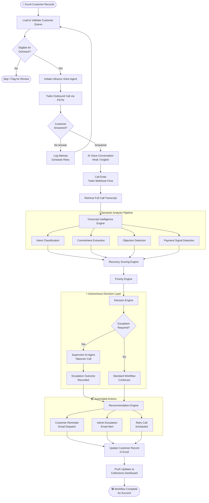

<div align="center">

<br/>

```
 █████╗  ██████╗ ██████╗ ██████╗ ██╗     ███████╗ ██████╗████████╗██╗ ██████╗ ███╗   ██╗███████╗
██╔══██╗██╔════╝██╔════╝██╔═══██╗██║     ██╔════╝██╔════╝╚══██╔══╝██║██╔═══██╗████╗  ██║██╔════╝
███████║██║     ██║     ██║   ██║██║     █████╗  ██║        ██║   ██║██║   ██║██╔██╗ ██║███████╗
██╔══██║██║     ██║     ██║   ██║██║     ██╔══╝  ██║        ██║   ██║██║   ██║██║╚██╗██║╚════██║
██║  ██║╚██████╗╚██████╗╚██████╔╝███████╗███████╗╚██████╗   ██║   ██║╚██████╔╝██║ ╚████║███████║
╚═╝  ╚═╝ ╚═════╝ ╚═════╝ ╚═════╝ ╚══════╝╚══════╝ ╚═════╝   ╚═╝   ╚═╝ ╚═════╝ ╚═╝  ╚═══╝╚══════╝
```

# AI Collections Platform

### Agentic AI-Powered Payment Recovery & Collections Management System

<br/>

[](https://nodejs.org)
[](https://expressjs.com)
[](https://twilio.com)
[](https://ultravox.ai)
[](https://chartjs.org)
[](LICENSE)
[](CONTRIBUTING.md)
[]()

<br/>

> **An end-to-end autonomous collections platform that replaces manual call center operations with a fleet of coordinated AI agents — capable of conducting voice conversations, analyzing intent, scoring recovery probability, escalating complex cases, and updating a real-time dashboard, entirely without human intervention.**

<br/>

[📖 Documentation](#-implementation-details) · [🚀 Quick Start](#-quick-start) · [🗺️ Roadmap](#️-future-roadmap) · [🤝 Contributing](#-contributing)

---

</div>

## Table of Contents

- [Project Overview](#-project-overview)
- [System Architecture](#-system-architecture)
- [Tech Stack](#-tech-stack)
- [Core Features](#-core-features)
- [Workflow](#-end-to-end-workflow)
- [Project Structure](#-project-structure)
- [Implementation Details](#-implementation-details)
- [Engineering Challenges Solved](#-engineering-challenges-solved)
- [Quick Start](#-quick-start)
- [Environment Variables](#-environment-variables)
- [API Reference](#-api-reference)
- [Resume Impact](#-portfolio--resume-impact)
- [Future Roadmap](#️-future-roadmap)
- [Contributing](#-contributing)

---

## 🎯 Project Overview

The **AI Collections Platform** is a production-grade, agentic AI system that fully automates the end-to-end customer payment recovery lifecycle. It replaces the fragmented, manual call-center process with a coordinated multi-agent pipeline that operates autonomously from initial outreach to final resolution.

The platform ingests customer records from Excel, orchestrates outbound AI voice calls via Ultravox and Twilio, transcribes and semantically analyzes conversations in real time, scores each account for recovery probability, generates actionable recommendations, routes escalations to a supervisor AI agent, dispatches email communications, and surfaces all insights on a live collections dashboard.

### Business Problem Solved

Traditional collections operations are expensive, inconsistent, and unscalable:

| Challenge | Manual Operations | AI Collections Platform |
|---|---|---|
| **Agent Capacity** | 60–80 calls/agent/day | Unlimited concurrent calls |
| **Consistency** | Varies per agent | Deterministic, policy-driven |
| **Transcript Analysis** | Manual review | Real-time LLM semantic analysis |
| **Recovery Scoring** | Spreadsheet-based | Automated multi-factor engine |
| **Escalation Routing** | Supervisor judgment | Autonomous rule + AI-driven |
| **Dashboard Lag** | End-of-day reports | Real-time live updates |
| **Language Support** | Agent-dependent | Hindi + English (extensible) |
| **Operating Cost** | High (headcount) | Infrastructure-only |

---

## 🏗️ System Architecture

The platform is organized as a layered, event-driven architecture. Workflow state is owned by the orchestration layer, while specialized AI engines are invoked as pure services — keeping the system modular, testable, and independently scalable.

```
┌─────────────────────────────────────────────────────────────────────┐
│                        AI COLLECTIONS PLATFORM                      │
│                                                                     │
│  ┌──────────────┐    ┌──────────────────────────────────────────┐  │
│  │   Data Layer  │    │            Orchestration Layer           │  │
│  │              │    │                                          │  │
│  │  Excel/XLSX  │───▶│  Main Workflow Engine  (index.js)        │  │
│  │  Customer DB  │    │  Webhook Event Handler (webhookServer)   │  │
│  └──────────────┘    └────────────────┬─────────────────────────┘  │
│                                       │                             │
│           ┌───────────────────────────┼───────────────────────┐    │
│           ▼                           ▼                       ▼    │
│  ┌────────────────┐  ┌─────────────────────────┐  ┌────────────┐  │
│  │  Voice AI Layer│  │    Intelligence Layer    │  │  Comms     │  │
│  │                │  │                         │  │  Layer     │  │
│  │  Ultravox Agent│  │  Transcript Analyzer     │  │            │  │
│  │  Twilio Voice  │  │  Recovery Score Engine   │  │  Email     │  │
│  │  Call Manager  │  │  Priority Engine         │  │  Reminder  │  │
│  │  Supervisor AI │  │  Decision Engine         │  │  Escalation│  │
│  └────────────────┘  │  Recommendation Engine   │  │  Alerts    │  │
│                       └─────────────────────────┘  └────────────┘  │
│                                                                     │
│  ┌──────────────────────────────────────────────────────────────┐  │
│  │                    Presentation Layer                         │  │
│  │          Real-Time Collections Dashboard (Frontend)           │  │
│  └──────────────────────────────────────────────────────────────┘  │
└─────────────────────────────────────────────────────────────────────┘
```

---

## 🛠️ Tech Stack

### Frontend

| Technology | Purpose |
|---|---|
| **HTML5 / CSS3** | Dashboard structure and styling |
| **Vanilla JavaScript** | Real-time interactivity, API polling, DOM management |
| **Chart.js** | KPI visualizations, recovery analytics charts |

### Backend

| Technology | Purpose |
|---|---|
| **Node.js 18+** | Async runtime, event-driven orchestration |
| **Express.js** | REST API server, webhook receiver |
| **Ngrok** | Secure tunnel for Twilio webhook delivery |

### Voice AI

| Technology | Purpose |
|---|---|
| **Ultravox** | Conversational Voice AI agent (LLM + TTS/STT) |
| **Twilio Voice API** | Outbound PSTN call initiation and management |
| **WebSocket** | Real-time bidirectional audio streaming |

### AI / Intelligence

| Component | Technology | Purpose |
|---|---|---|
| **Transcript Analyzer** | LLM (via Ultravox) | Semantic intent extraction |
| **Recovery Scoring Engine** | Custom scoring algorithm | Probability of payment |
| **Priority Engine** | Weighted multi-factor model | Collections prioritization |
| **Decision Engine** | Rule-based + AI hybrid | Escalation and routing logic |
| **Recommendation Engine** | LLM-powered reasoning | Autonomous action suggestions |

### Data & Infrastructure

| Technology | Purpose |
|---|---|
| **xlsx (SheetJS)** | Excel read/write for customer records |
| **REST APIs** | Inter-service communication |
| **Webhooks** | Twilio event delivery (call status, completion) |
| **Nodemailer / SMTP** | Email reminder and escalation dispatch |

---

## ✨ Core Features

### 🎙️ Voice AI Collections Agent

The primary collections agent is an Ultravox-powered conversational AI, deployed via Twilio's PSTN network. It conducts fully autonomous outbound calls with customers in natural language.

- **Autonomous outbound calling** — reads the customer queue and initiates calls without human initiation
- **Natural conversation handling** — collects commitments, handles objections, answers payment queries
- **Hindi language support** — conducts conversations in Hindi for regional customer bases
- **Structured commitment capture** — extracts payment dates, amounts, and promises from unstructured conversation

### 🧠 Supervisor Escalation Agent

A secondary AI agent is activated when the primary agent detects high-risk scenarios or complex objections beyond its resolution threshold.

- **Autonomous takeover** — receives escalated calls and applies advanced negotiation logic
- **High-risk account handling** — tailored conversation strategies for difficult-to-recover accounts
- **Escalation outcome recording** — captures supervisor interaction results back into the workflow

### 📊 Transcript Intelligence Engine

Every call transcript is processed through a multi-stage semantic analysis pipeline:

- **Payment intent detection** — classifies customer disposition (willing to pay, disputing, requesting time)
- **Commitment extraction** — identifies explicit promises (amount, date, method)
- **Payment completion signals** — detects when a customer reports already having paid
- **Objection mapping** — categorizes the type and severity of customer objections

### 📈 Recovery Intelligence Engine

A multi-factor scoring model that evaluates each account's probability of successful recovery:

- Weighted scoring across conversation sentiment, commitment strength, historical behavior, and outstanding amount
- Risk level assignment (Low / Medium / High / Critical)
- Identification of accounts requiring special handling

### 🎯 Priority Engine

Generates a composite priority score to help collections teams focus effort on the highest-impact accounts:

- Combines recovery probability, outstanding balance, aging bucket, and risk level
- Normalized 0–100 priority index
- Dynamic re-scoring after each interaction

### 💡 Recommendation Engine

Produces autonomous, account-level action recommendations without human input:

- **Escalate to supervisor** — triggered by risk signals and failed negotiation
- **Schedule retry call** — determines optimal callback timing
- **Send payment reminder** — triggers automated email with personalized content
- **Mark for legal review** — for chronic non-responders past threshold

### 📋 Real-Time Collections Dashboard

A live web dashboard providing full operational visibility:

| Panel | Contents |
|---|---|
| **KPI Strip** | Total accounts, calls made, recovery rate, revenue recovered |
| **Customer Table** | Account status, score, priority, last action, recommendations |
| **Recovery Analytics** | Chart.js charts for trend analysis and funnel visualization |
| **Workflow Monitor** | Live call states, queue depth, agent availability |
| **AI Recommendations** | Per-account AI-generated actions, ready for one-click execution |
| **Activity Feed** | Chronological event log of all system actions |

---

## 🔄 End-to-End Workflow



---

## 📁 Project Structure

```
ai-collections-platform/
│
├── 📁 frontend/                    # Real-time dashboard UI
│   ├── index.html                  # Dashboard layout and structure
│   ├── styles.css                  # Dashboard styling, responsive layout
│   └── app.js                      # Chart.js visualizations, API polling, DOM updates
│
├── 📁 services/                    # Core AI and integration services
│   ├── ultravoxService.js          # Ultravox agent creation, call lifecycle management
│   ├── twilioService.js            # Twilio outbound call initiation, status tracking
│   ├── transcriptService.js        # Transcript retrieval and preprocessing
│   ├── analysisService.js          # LLM-powered semantic transcript analysis
│   ├── scoringService.js           # Recovery probability and priority scoring
│   ├── decisionService.js          # Escalation logic and decision routing
│   ├── recommendationService.js    # Autonomous recommendation generation
│   ├── emailService.js             # Customer reminders and admin escalation emails
│   └── supervisorService.js        # Supervisor AI agent orchestration
│
├── 📁 utils/                       # Shared utilities and helpers
│   ├── excelUtils.js               # Excel read/write operations (SheetJS)
│   ├── logger.js                   # Structured logging
│   ├── validators.js               # Input validation and data sanitization
│   └── helpers.js                  # General-purpose utility functions
│
├── 📁 data/                        # Data layer
│   ├── customers.xlsx              # Customer records (source of truth)
│   └── templates/                  # Email and prompt templates
│       ├── reminderEmail.html      # Customer payment reminder template
│       └── escalationEmail.html    # Admin escalation alert template
│
├── index.js                        # Main orchestration engine, workflow entry point
├── webhookServer.js                # Express webhook server for Twilio event callbacks
├── .env.example                    # Environment variable reference
├── package.json
└── README.md
```

### Directory Responsibilities

| Directory | Responsibility |
|---|---|
| `frontend/` | Standalone dashboard UI; polls backend REST endpoints; renders KPIs and analytics using Chart.js |
| `services/` | All AI, voice, scoring, and communication logic; each file is a single-responsibility service module |
| `utils/` | Stateless helper functions shared across services; Excel I/O, logging, validation |
| `data/` | Persistent customer data in Excel format; HTML email templates |
| `index.js` | Top-level workflow orchestrator; sequences the entire pipeline per account |
| `webhookServer.js` | Event receiver for Twilio callbacks; bridges async call events into the synchronous workflow |

---

## 🔬 Implementation Details

### Voice AI Architecture

The voice layer is built on a tight integration between **Ultravox** (the conversational AI engine) and **Twilio** (PSTN call infrastructure):

1. **Agent Provisioning** — `ultravoxService.js` creates a new Ultravox agent session per call, injecting a system prompt that defines the collections persona, conversation policy, language preference (Hindi/English), and escalation triggers.

2. **Call Initiation** — `twilioService.js` initiates an outbound PSTN call using Twilio's Voice API, passing the Ultravox WebSocket audio stream URL as the TwiML `<Connect>` target. This bridges the phone network to the AI agent in real time.

3. **Audio Streaming** — A bidirectional WebSocket connection carries raw audio between Twilio (customer's phone) and Ultravox (AI agent), with sub-200ms latency for natural conversation flow.

4. **Call Termination** — When the conversation ends (natural conclusion or timeout), Twilio fires a completion webhook to `webhookServer.js`, which captures the final call status and initiates the post-call pipeline.

```
Customer Phone ◄──── PSTN ────► Twilio ◄──── WebSocket ────► Ultravox AI Agent
                                   │
                                   ▼
                           Webhook Events
                                   │
                                   ▼
                          webhookServer.js
```

### Call Lifecycle

```
INITIATED → RINGING → ANSWERED → IN_PROGRESS → COMPLETED → [POST-CALL PIPELINE]
                │                                    │
            NO_ANSWER                           FAILED/BUSY
                │                                    │
          Schedule Retry                      Log & Reschedule
```

Each state transition is logged and persisted to the customer's Excel record, providing a complete interaction audit trail.

### Transcript Processing Pipeline

After call completion, the transcript is retrieved from Ultravox and passed through a multi-stage NLP pipeline:

```
Raw Transcript
      │
      ▼
┌─────────────────────────────────────────┐
│  Stage 1: Text Normalization            │
│  - Strip filler words                   │
│  - Segment by speaker (AI / Customer)   │
│  - Timestamp alignment                  │
└────────────────────┬────────────────────┘
                     │
                     ▼
┌─────────────────────────────────────────┐
│  Stage 2: Intent Classification          │
│  - LLM prompt: classify customer intent  │
│  - Output: WILLING / DISPUTING /         │
│    NEEDS_TIME / ALREADY_PAID / UNKNOWN  │
└────────────────────┬────────────────────┘
                     │
                     ▼
┌─────────────────────────────────────────┐
│  Stage 3: Commitment Extraction          │
│  - Extract: payment date, amount         │
│  - Extract: preferred payment method     │
│  - Confidence scoring per extraction     │
└────────────────────┬────────────────────┘
                     │
                     ▼
┌─────────────────────────────────────────┐
│  Stage 4: Objection & Signal Detection   │
│  - Classify objection type              │
│  - Flag "already paid" signals           │
│  - Detect escalation triggers            │
└─────────────────────────────────────────┘
```

### Escalation Workflow

The escalation system is a two-agent handoff pattern:

1. **Escalation Trigger Detection** — the primary agent's transcript is analyzed for escalation signals: explicit refusal, dispute of principal amount, legal threats, or a recovery score below the escalation threshold.

2. **Supervisor Agent Invocation** — `supervisorService.js` creates a new Ultravox agent session with a supervisor-tier system prompt featuring advanced negotiation tactics and higher resolution authority.

3. **Warm Handoff** — the call context (transcript summary, account details, detected objections) is injected into the supervisor agent's context window before it takes over.

4. **Outcome Recording** — the supervisor session's transcript and resolution outcome are persisted, and admin escalation emails are dispatched to the collections team.

```
Primary Agent Flags Escalation
            │
            ▼
  decisionService.js evaluates risk signals
            │
     ESCALATE? ──── No ──▶ Standard workflow
            │
           Yes
            │
            ▼
  supervisorService.js provisions Supervisor Agent
  with injected account context
            │
            ▼
  Supervisor conducts advanced negotiation
            │
            ▼
  Outcome → Excel Update + Escalation Email
```

### Dashboard Architecture

The frontend dashboard is a single-page application that maintains live state via periodic REST API polling:

- **Data Flow** — `app.js` polls `/api/dashboard` every 30 seconds for updated KPIs, account statuses, and activity events
- **Charts** — Chart.js renders recovery trend lines, intent distribution donut charts, and priority score histograms
- **Customer Table** — dynamically rendered with color-coded risk badges, inline score display, and recommendation chips
- **Activity Feed** — append-only event log that reflects all system actions in chronological order

### Recommendation Engine

The recommendation engine receives enriched account data (intent, score, priority, history) and issues one or more recommended actions:

| Input Signal | Generated Recommendation |
|---|---|
| Intent = WILLING, Score > 70 | Send payment reminder email |
| Score < 30, Objections detected | Escalate to supervisor |
| No answer (3+ attempts) | Schedule alternate-time retry |
| Intent = ALREADY_PAID | Mark for payment verification |
| Score 30–70, first contact | Schedule callback in 48 hours |
| Objection = DISPUTE | Flag for legal/compliance review |

Recommendations are surfaced on the dashboard and can be executed with a single click, keeping a human-in-the-loop for final approval while eliminating all cognitive and logistical overhead.

---

## 🧩 Engineering Challenges Solved

### 1. Twilio + Ultravox Integration

**Challenge:** Twilio's Voice API and Ultravox use different audio streaming protocols. Bridging a live PSTN call to an LLM-based voice agent required constructing TwiML that dynamically references Ultravox's WebSocket stream endpoint, generated at session creation time.

**Solution:** `ultravoxService.js` first creates an Ultravox session and receives a unique WebSocket URL. `twilioService.js` then injects this URL into a `<Connect><Stream>` TwiML instruction, passed as the call's webhook response — creating the real-time audio bridge without additional middleware.

### 2. Asynchronous Call Lifecycle with Webhooks

**Challenge:** Twilio call events (answered, completed, failed) are delivered asynchronously via webhooks, while the main orchestration loop is sequential. Coordinating these two execution contexts without race conditions required careful state management.

**Solution:** `webhookServer.js` operates as a separate Express server, receiving Twilio callbacks and publishing call state updates to a shared in-memory state store. The main workflow engine polls or awaits this state, allowing the async event stream to integrate cleanly with the sequential pipeline.

### 3. Transcript Parsing Reliability

**Challenge:** Raw Ultravox transcripts are unstructured text with mixed speaker turns, filler words, and informal Hindi/English (code-switching). Naïve parsing produced noisy extraction results.

**Solution:** A multi-stage normalization pipeline (see [Transcript Processing Pipeline](#transcript-processing-pipeline)) separates speaker turns, strips noise, and applies structured LLM prompts with explicit output schemas (JSON) and few-shot examples to enforce reliable commitment and intent extraction.

### 4. Multi-Agent Orchestration

**Challenge:** Coordinating the hand-off between the primary collections agent and the supervisor escalation agent — including passing conversation context — without duplicating infrastructure or breaking call continuity.

**Solution:** The supervisor agent is provisioned with a context-enriched system prompt that includes a summarized transcript of the primary call, key objections, and account details. This creates a seamless knowledge transfer without requiring shared state between the two agent sessions.

### 5. Excel Synchronization as Persistent State

**Challenge:** Using Excel as the persistence layer means concurrent read/write operations from multiple workflow executions risk data corruption or stale reads.

**Solution:** `excelUtils.js` implements a file-lock pattern — each read/write operation acquires an exclusive lock on the file, performs its operation, and releases immediately. The customer record is treated as immutable within a single workflow run; updates are batched and written at pipeline completion.

### 6. Real-Time Dashboard Without a Database

**Challenge:** The system uses Excel as its data store, but the dashboard requires low-latency reads for a live UX. Reading Excel on every poll request is too slow.

**Solution:** An in-memory cache layer in the backend API aggregates customer data at pipeline checkpoints. The dashboard polls this cache rather than the Excel file directly, keeping response times under 50ms while the cache is kept fresh by workflow update events.

### 7. Webhook Delivery in Development

**Challenge:** Twilio requires a publicly accessible HTTPS endpoint to deliver call webhooks. This is incompatible with local development behind NAT.

**Solution:** Ngrok is auto-launched at startup to create an encrypted tunnel, and the public URL is dynamically injected into the Twilio call webhook configuration — enabling full end-to-end development with real phone calls on a local machine.

---

## 🚀 Quick Start

### Prerequisites

- Node.js 18+
- A Twilio account with a voice-capable phone number
- An Ultravox API key
- An SMTP-capable email account (Gmail/SendGrid)
- Ngrok (or a static public endpoint)

### Installation

```bash
# Clone the repository
git clone https://github.com/your-username/ai-collections-platform.git
cd ai-collections-platform

# Install dependencies
npm install

# Copy environment variable template
cp .env.example .env
# → Fill in your Twilio, Ultravox, and SMTP credentials
```

### Configure Customer Data

Populate `data/customers.xlsx` with your customer records. The system expects the following columns:

| Column | Description | Example |
|---|---|---|
| `customer_id` | Unique account identifier | `CUST-001` |
| `name` | Customer full name | `Priya Sharma` |
| `phone` | E.164 phone number | `+919876543210` |
| `email` | Email address | `priya@example.com` |
| `outstanding_amount` | Amount due (INR) | `15000` |
| `due_date` | Payment due date | `2024-02-01` |
| `language` | Preferred language | `Hindi` |
| `status` | Workflow state | `PENDING` |

### Run the Platform

```bash
# Start the main orchestration engine
npm start

# The dashboard will be accessible at:
# http://localhost:3000

# The webhook server will be accessible at:
# http://localhost:3001

# Ngrok tunnel URL will be printed in the console
# and automatically configured with Twilio
```

---

## ⚙️ Environment Variables

```env
# Twilio
TWILIO_ACCOUNT_SID=ACxxxxxxxxxxxxxxxxxxxxxxxxxxxxxxxx
TWILIO_AUTH_TOKEN=xxxxxxxxxxxxxxxxxxxxxxxxxxxxxxxx
TWILIO_PHONE_NUMBER=+1XXXXXXXXXX

# Ultravox
ULTRAVOX_API_KEY=your_ultravox_api_key

# Email (SMTP)
SMTP_HOST=smtp.gmail.com
SMTP_PORT=587
SMTP_USER=your_email@gmail.com
SMTP_PASS=your_app_password
ADMIN_EMAIL=admin@yourcompany.com

# Server
PORT=3000
WEBHOOK_PORT=3001
NODE_ENV=development

# Ngrok (optional — auto-configured if installed)
NGROK_AUTH_TOKEN=your_ngrok_token
```

---

## 📡 API Reference

### Dashboard

| Endpoint | Method | Description |
|---|---|---|
| `/api/dashboard` | `GET` | Full dashboard state (KPIs, accounts, activity) |
| `/api/customers` | `GET` | All customer records with current scores |
| `/api/customers/:id` | `GET` | Single account detail view |
| `/api/recommendations` | `GET` | All pending AI recommendations |
| `/api/recommendations/:id/execute` | `POST` | Execute a recommendation action |

### Workflow Control

| Endpoint | Method | Description |
|---|---|---|
| `/api/workflow/start` | `POST` | Start the collections workflow run |
| `/api/workflow/status` | `GET` | Current run status and progress |
| `/api/calls/:id` | `GET` | Call detail including transcript and scores |

### Webhooks (Twilio)

| Endpoint | Method | Description |
|---|---|---|
| `/webhook/call-status` | `POST` | Twilio call lifecycle events |
| `/webhook/call-completed` | `POST` | Post-call processing trigger |

---

## 💼 Portfolio & Resume Impact

This project demonstrates a rare combination of AI engineering disciplines that directly maps to what top-tier companies and AI-native startups are hiring for in 2024–2025.

### What This Project Proves

#### 🤖 Agentic AI Systems Design
You have built and orchestrated **multiple autonomous AI agents** (primary collector, supervisor escalator) that make independent decisions, hand off context, and operate across an end-to-end workflow without human intervention. This is the defining skill of the emerging AI Engineering discipline.

#### 🔗 Workflow Orchestration
The platform implements a complete **multi-stage, event-driven workflow pipeline** — from data ingestion through voice call through semantic analysis through email dispatch through dashboard update. Managing async state across these stages demonstrates production-grade systems design.

#### 🎙️ Voice AI Engineering
Ultravox + Twilio integration is a **non-trivial, production-relevant technical skill**. Voice AI is one of the highest-growth categories in enterprise AI adoption. Building a working voice agent that handles real phone calls, manages conversation context, and produces structured analytical output is a strong differentiator.

#### 🌐 Full Stack AI Development
The project spans the complete stack: Excel data ingestion → Node.js backend orchestration → REST APIs → real-time frontend dashboard → Chart.js analytics. This demonstrates that you can **own a feature end-to-end**, not just contribute to a slice.

#### 📦 AI Product Engineering
You have not just trained a model — you have built an **AI-powered product** with real business logic: scoring engines, decision trees, escalation policies, email automation, and a live operations dashboard. This is the difference between a data science project and an AI product.

### How to Position This on Your Resume

```
AI Collections Platform | Node.js · Ultravox · Twilio · Chart.js · LLM APIs
• Designed and built an end-to-end agentic AI platform automating the full
  payment recovery lifecycle across voice, analysis, and communications layers
• Integrated Ultravox Voice AI with Twilio PSTN to conduct autonomous
  outbound collections calls with real-time transcript analysis
• Implemented multi-agent orchestration with autonomous escalation routing
  between primary and supervisor AI agents based on LLM-scored risk signals
• Built LLM-powered semantic pipeline to extract payment intent, commitments,
  and objections from unstructured conversation transcripts
• Engineered multi-factor Recovery Scoring and Priority Engine to rank
  accounts by collection probability across 6 weighted dimensions
• Deployed real-time collections dashboard with Chart.js analytics, live
  KPI monitoring, and one-click recommendation execution
```

---

## 🗺️ Future Roadmap

| Milestone | Feature | Status |
|---|---|---|
| **v1.1** | Multi-agent orchestration framework (LangGraph / CrewAI) | 🔵 Planned |
| **v1.2** | Vector memory for persistent customer interaction history | 🔵 Planned |
| **v1.3** | CRM integrations (Salesforce, HubSpot, Zoho) | 🔵 Planned |
| **v1.4** | WhatsApp automation via Twilio WhatsApp API | 🔵 Planned |
| **v2.0** | Predictive recovery analytics (ML-based likelihood modeling) | 🔵 Planned |
| **v2.1** | Multi-language support (Tamil, Telugu, Bengali, Marathi) | 🔵 Planned |
| **v2.2** | Human-in-the-loop approval workflows for high-value escalations | 🔵 Planned |
| **v2.3** | PostgreSQL / Supabase migration from Excel persistence | 🔵 Planned |
| **v3.0** | Fully autonomous multi-tenant SaaS deployment | 🔵 Planned |

---

## 🤝 Contributing

Contributions are welcome. Please open an issue first to discuss what you'd like to change. For major changes, a design discussion is recommended before implementation.

```bash
# Fork the repository
# Create your feature branch
git checkout -b feature/your-feature-name

# Commit your changes
git commit -m 'feat: add your feature'

# Push to the branch
git push origin feature/your-feature-name

# Open a Pull Request
```

Please follow the existing code style and ensure your changes do not break the core workflow pipeline.

---

## 📄 License

This project is licensed under the MIT License. See [LICENSE](LICENSE) for details.

---

<div align="center">

**Built with purposeful engineering. Designed to recover value at scale.**

<br/>

[](https://github.com/your-username/ai-collections-platform)
[](https://github.com/your-username/ai-collections-platform/fork)

<br/>

*If this project was useful or impressive, a ⭐ on GitHub is appreciated.*

</div>